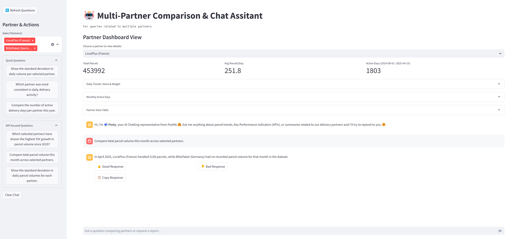

# 📦 Posty — AI Chatbot for PostNL Cross-Border Partner Analytics

**Posty** is an LLM-powered analytics assistant developed for **PostNL’s Cross Border Solutions (CBS)** team. It empowers delivery partners—such as **PaccoPronto**, **LivraPlus**, **BlitzPaket**, and **Parcelly**—to interactively explore and analyze delivery trends using a conversational interface. Posty assists in capacity planning and performance review by providing time-series forecasts, KPI summaries, and comparative insights in a production-ready, containerized web application.

  

---

## ✅ Key Capabilities

- 📊 **Interactive Partner Dashboard**: Delivery metrics, trends, and volume summaries per logistics partner.
- 🤖 **Conversational AI Interface**: Intuitive chatbot for querying partner-specific data insights.
- 📈 **Time-based Analytics**: Historical KPIs, trend detection, YoY comparisons.
- 🔍 **Multi-Partner Comparison**: Cross-partner operational benchmarking and anomaly detection.

---

## 🗂️ Directory Structure

```
posty/
├── main.py                  # Streamlit app entry point
├── agent.py                 # LLM initialization & prompt engineering
├── etl.py                   # Data ingestion and preprocessing pipeline
├── utils.py                 # KPI utilities and summary generators
├── requirements.txt         # Python dependencies
├── .env                     # API key and environment variables
├── data/
│   └── parcel_per_network_partner.csv  # Input dataset
└── Dockerfile (optional)    # Containerization for deployment
```

---

## ⚙️ Environment Setup

**Option 1 — Using `virtualenv`**
```bash
python -m venv venv
source venv/bin/activate  # On Windows: venv\Scripts\activate
pip install --upgrade pip
pip install -r requirements.txt
```

**Option 2 — Using `conda`**
```bash
conda create -n posty-env python=3.10
conda activate posty-env
pip install --upgrade pip
pip install -r requirements.txt
```

---

## 🔐 API Configuration

Create a `.env` file in the root directory:
```
DEEPSEEK_API_KEY=your_api_key_here
```

> ⚠️ Replace `your_api_key_here` with a valid DeepSeek API key to enable chatbot functionality.

---

## 🚀 Running the Application

To launch the application locally:
```bash
streamlit run main.py
```

Then visit: [http://localhost:8501](http://localhost:8501)

---

## 🐳 Docker Deployment (Optional)

**1. Build the Docker image**
```bash
docker build -t posty-ui .
```

**2. Run the container**
```bash
docker run --env DEEPSEEK_API_KEY=your_api_key_here posty-ui
```

---
## 🧾 Supporting Files Overview

| File Name         | Purpose                                                                 |
|-------------------|-------------------------------------------------------------------------|
| `main.py`         | Entry point for the Streamlit web application; manages UI and chat flow.|
| `agent.py`        | Constructs and initializes the DeepSeek-based LLM agents with tailored prompts. |
| `etl.py`          | Handles data extraction, transformation, and persistence to DuckDB.     |
| `utils.py`        | Provides analytical utility functions for KPI computation and summaries. |
| `requirements.txt`| Lists Python package dependencies required to run the application.      |
| `.env`            | Contains the API key for authenticating with the DeepSeek LLM service.  |
| `data/parcel_per_network_partner.csv` | Sample dataset used for analytics, including delivery records. |

---

## 📊 Input Data Specification

Expected CSV file: `./data/parcel_per_network_partner.csv`

| Column Name              | Description                             |
|--------------------------|-----------------------------------------|
| `date`                   | Parcel delivery date (YYYY-MM-DD)       |
| `item`                   | Number of parcels                       |
| `weight`                 | Weight of parcels (kg)                  |
| `final_network_partner`  | Partner responsible for final delivery  |

---

## 🎯 Target Audience

This MVP is tailored for **operational planners** at partner logistics firms. These users are non-technical but require timely and interpretable access to forecast insights for planning last-mile delivery resources effectively.

---
